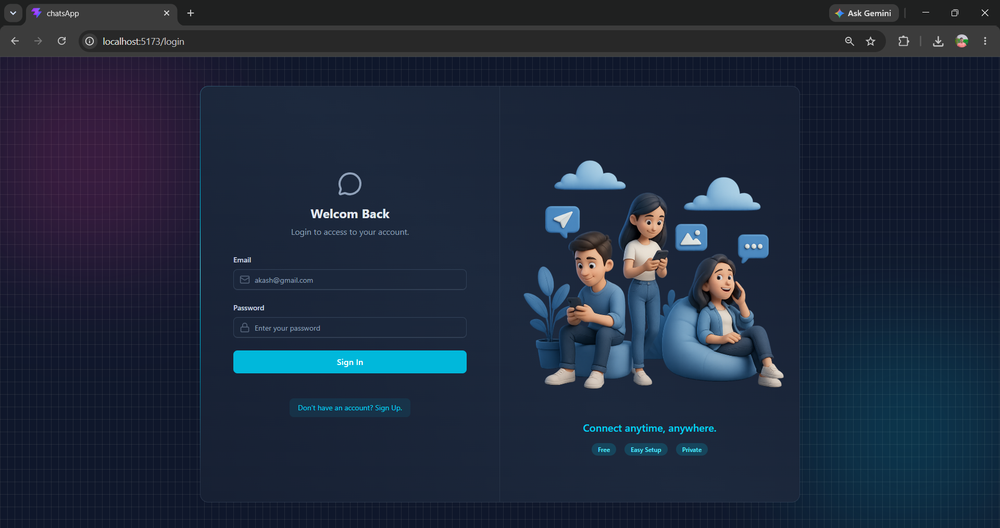
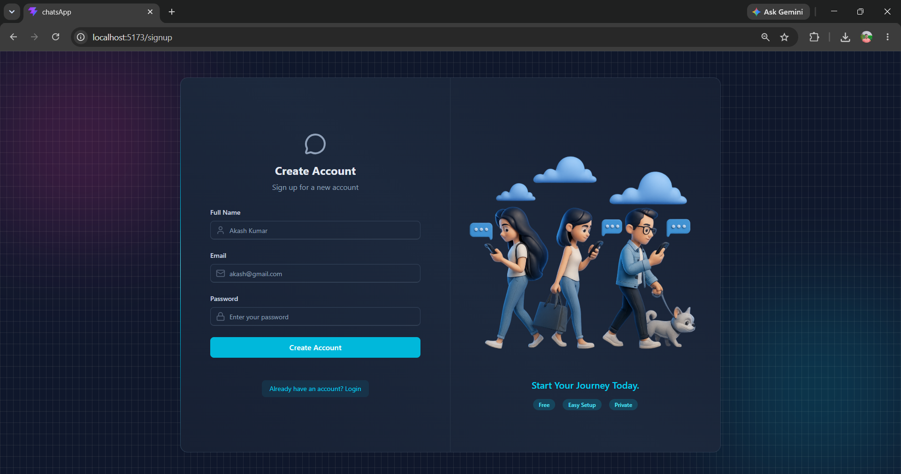
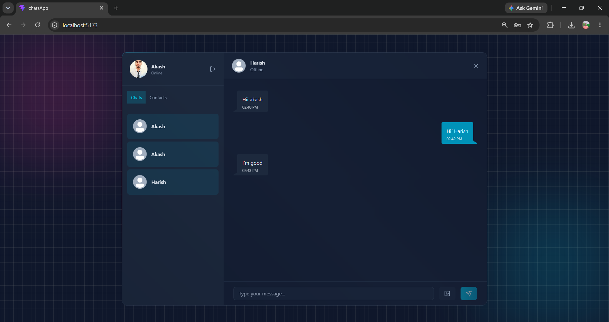

# 💬 ChatsApp - Real-Time Chat Application

A full-stack real-time chat application that enables users to securely exchange instant messages, share images, and see online user status using **Socket.IO**. The application features secure JWT authentication, cloud-based image storage, and a responsive modern UI.

---

## 🚀 Features

- 🔐 Secure user authentication using JWT and HTTP-only cookies
- 💬 Real-time one-to-one messaging with Socket.IO
- 🟢 Live online/offline user status
- 🖼️ Image sharing using Cloudinary
- 📩 Automated welcome emails using Resend Email API
- 🔒 Password encryption with bcrypt
- 📜 Persistent chat history stored in MongoDB
- 🎨 Responsive UI built with React, Tailwind CSS, and DaisyUI
- ⚡ Global state management using Zustand

---

## 📸 Screenshots

### Login



### Signup



### Chat Screen




## 🛠️ Tech Stack

### Frontend
- React.js
- Vite
- Tailwind CSS
- DaisyUI
- Zustand
- Axios

### Backend
- Node.js
- Express.js
- Socket.IO
- JWT Authentication
- bcrypt
- Cookie Parser

### Database
- MongoDB
- Mongoose

### Cloud & Services
- Cloudinary
- Resend Email API

---

## 📂 Project Structure

```
ChatsApp
│
├── backend
│   ├── src
│   │   ├── controllers
│   │   ├── db
│   │   ├── emails
│   │   ├── middlewares
│   │   ├── models
│   │   ├── routes
│   │   ├── utils
│   │   └── server.js
│   │
│   ├── package.json
│   └── .env
│
├── frontend
│   ├── public
│   │   ├── login.png
│   │   └── signup.png
│   │
│   ├── src
│   │   ├── components
│   │   ├── lib
│   │   ├── pages
│   │   ├── store
│   │   ├── App.jsx
│   │   ├── main.jsx
│   │   └── index.css
│   │
│   ├── package.json
│   └── vite.config.js
│
└── README.md
```

---

## ⚙️ Installation

### 1. Clone the repository

```bash
git clone https://github.com/akash16-10/ChatsApp
```

```bash
cd ChatsApp
```

---

### 2. Install Backend Dependencies

```bash
cd backend
npm install
```

---

### 3. Install Frontend Dependencies

```bash
cd ../frontend
npm install
```

---

## 🔑 Environment Variables

Create a `.env` file inside the **backend** folder.

```env
PORT=5000

MONGODB_URI=your_mongodb_connection_string

JWT_SECRET=your_jwt_secret

NODE_ENV=development

CLOUDINARY_CLOUD_NAME=your_cloud_name
CLOUDINARY_API_KEY=your_api_key
CLOUDINARY_API_SECRET=your_api_secret

RESEND_API_KEY=your_resend_api_key

CLIENT_URL=http://localhost:5173
```

---

## ▶️ Run the Project

### Backend

```bash
cd backend
npm run dev
```

### Frontend

```bash
cd frontend
npm run dev
```

Open

```
http://localhost:5173
```

---


## 📌 API Features

### Authentication

- Register User
- Login User
- Logout User
- Get Current User

### Users

- Get All Users
- Update Profile

### Messages

- Send Message
- Get Chat History
- Image Messages

### Real-Time

- Live Messaging
- Online User Tracking

---

## 🔒 Security

- JWT Authentication
- HTTP-only Cookies
- Password Hashing (bcrypt)
- Protected Routes
- Secure File Uploads
- Input Validation

---

## 🌟 Future Improvements

- Group Chats
- Typing Indicators
- Read Receipts
- Message Reactions
- Voice Messages
- Video Calling
- Push Notifications
- Message Search
- File Sharing
- Dark/Light Theme
- End-to-End Encryption

---

## 👨‍💻 Author

**Akash Kumar Prajapati**

- GitHub: https://github.com/akash16-10
- LinkedIn: https://linkedin.com/in/akashprajapati051

---

## ⭐ If you like this project

Give it a ⭐ on GitHub!
